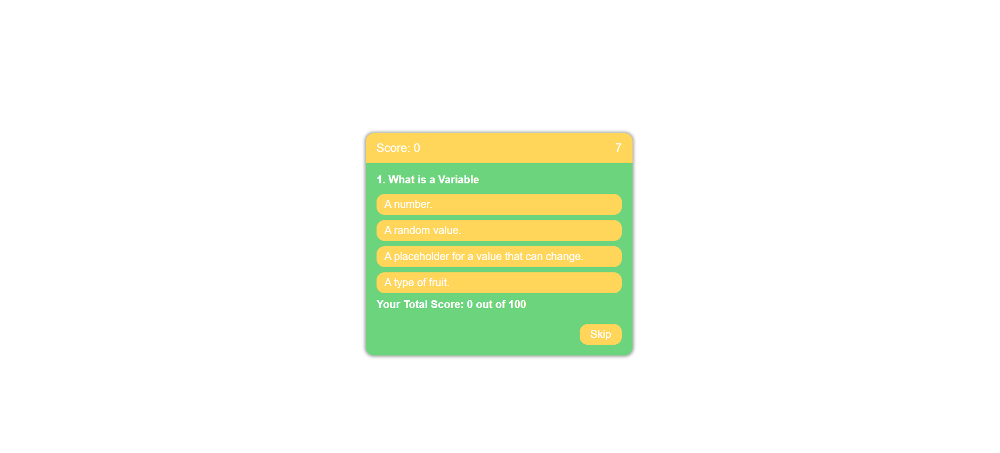

# Code-Quiz

## Link to the project 
https://samz1n.github.io/Code-Quiz/

## Goals for this Project
* Start button to begin a 20 second timer and begin quiz.
* When you answer a question you are presented with another question.
* When you answer incorrectly time is sutracted from the clock.
* When all questions are answered the game is over.
* When game is over you can write initials( I had immense trouble getting this to work and had alot of things come up in my life this week I apologize for not succeding in this task.)
 